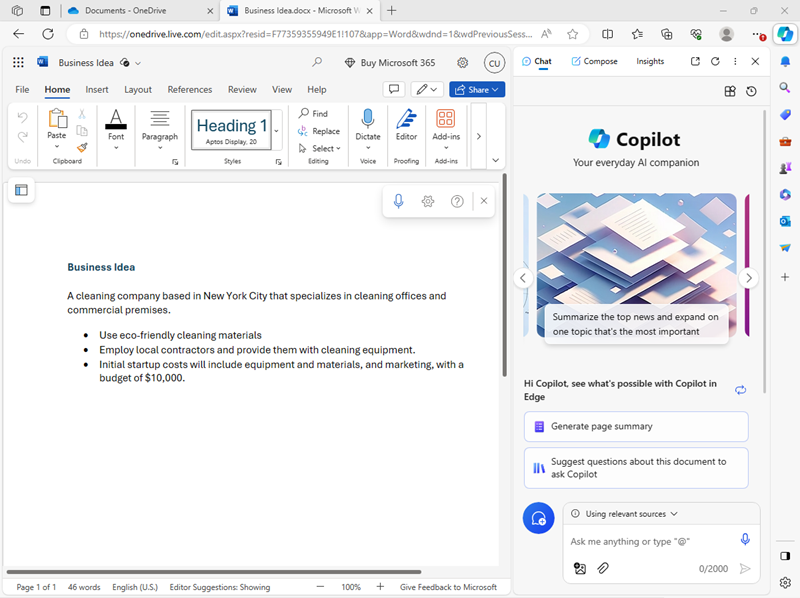

---
lab:
    title: 'Explore Copilot in Microsoft Edge'
    module: 'Module 1: Microsoft Copilot'
---
# Explore Microsoft Copilot in Microsoft Edge

In this exercise you will explore some of the ways in which Microsoft Copilot can use generative AI to help you be more productive when creating new content. In the scenario for this exercise, you will start with some high-level notes for a business idea, and use Copilot in Microsoft Edge to help you develop a business plan and a presentation for potential investors.

## Before you start

This exercise requires a free Microsoft account (for example an *outlook.com*, *live.com*. or *hotmail.com* account), and the Microsoft Edge web browser.

1. If you don;t already have Microsoft Edge installed, download and install it for free from [https://www.microsoft.com/edge/download](https://www.microsoft.com/edge/download).
1. If you don't already have a Microsoft account, sign up for one at [https://signup.live.com](https://signup.live.com).
1. Sign into Microsoft Edge using your Microsoft account.

> **Tip**: If you did not sign into Edge after creating your account, use the user account icon (&#128100;) on the Edge toolbar to sign in using a *personal* account.

## Use Copilot to examine a document

To start your exploration of generative AI, let's use Microsoft Copilot in Edge to examine an existing document and extract some insights from it.

1. Download the document [Business Idea.docx](https://github.com/GraemeMalcolm/mslearn-copilot/raw/main/data/generative-ai/Business%20Idea.docx) from `https://github.com/GraemeMalcolm/mslearn-copilot/raw/main/data/generative-ai/Business%20Idea.docx` to your local computer, saving it as **Business Idea.docx** in your local **Downloads** folder.
1. In Microsoft Edge, browse to [OneDrive](https://onedrive.live.com) at `https://onedrive.live.com` and sign in using your personal Microsoft account - closing any welcome messages or offers that are displayed.
1. In OneDrive, open your **Documents** folder. Then use the **+ Add new** button to upload the **Business Idea.docx** file from your local computer to OneDrive.
1. In OneDrive, open **Business Idea.docx** and view the text it contains, which describe some high -level ideas for a cleaning business in New York City.
1. Use the **Copilot** icon on the Edge toolbar to open the Copilot pane, as shown here:

    

1. In the Copilot pane, ensure that the **Chat** tab is selected and that the conversational style is set to **More Balanced** - this will ensure that Copilot responds with a balance of creativity and factual precision..
1. In the chat box at the bottom of the Copilot pane, enter the prompt `What is this document about?`. If prompted, confirm that you want to allow Copilot to access the page and acknowledge that the conversation will not be saved (note that Copilot protects the privacy of the conversation because it includes information from a personal document in your OneDrive).
1. Review the response from Copilot, which should summarize the main points in the document.

## Use Coplot to generate text

